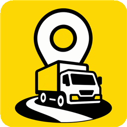

<p align="center">
  
</p>

<h1 align="center">길벗 (Gilbeot)</h1>

<p align="center">
  화물기사의 현장 경험(암묵지)을 AI 음성 인터뷰로 수집·구조화해<br>
  다른 기사에게 연결하는 현장 지식 공유 서비스
</p>

<p align="center">
  <a href="https://gilbeot-six.vercel.app"><strong>배포 URL → gilbeot-six.vercel.app</strong></a>
</p>

---

MOVE-AI Challenge 2026 출품작. **MVP 설계를 가진 프로토타입**이다 — DB 없이 시드 JSON과 브라우저 인메모리 상태로 동작하며, 트럭커 연동 데이터는 Mock으로 재현한다.

## 길벗은 내비게이션이 아니다

수집·제공 범위는 **도착지(화물센터)와 그 주변 장소의 경험**으로 한정한다. 경로 분석·경로 추천·도로 정보·실시간 교통은 서비스 범위 밖이다. 위치 데이터는 장소 방문·정차 식별과 인터뷰 후보 선정에만 쓴다.

목적지까지 가는 길은 내비게이션이 알려준다. 도착한 다음 어디로 들어가고, 어디서 기다리고, 어디서 쉬어야 하는지는 먼저 가본 기사가 알고 있다. 길벗은 그 경험을 모은다.

## 운행 여정 (기획서 6-1)

```
출발지·도착지 입력 → 도착지 브리핑 탐색 → 도착지 확정(지도 요약 정보) → 운행 시작
→ 운행 중 현재 위치 기반 암묵지 조회 → 도착지 도달(운행 종료) → AI 인터뷰
```

## 화면 구성

기사 화면은 위 운행 여정을 따라 배치했다. 기사 화면의 표시 용어는 "노하우"이고, 문서·관리자 화면은 정책 용어 "암묵지"를 그대로 쓴다.

| 경로 | 화면 |
|---|---|
| `/` | 랜딩 — 서비스 소개, 하단 관리자 진입 |
| `/login` | 로그인 — 시연용, 실제 인증 없음 |
| `/welcome` | 가입 환영 +100P |
| `/destination` | 출발지·도착지 입력 (출발지는 현재 위치 기본값) |
| `/briefing` | 도착지 브리핑 — 카테고리 4종별 정리, 잠긴 카드는 🔒·카테고리·장소·평가 수·작성일만 |
| `/home` | 홈 지도 — 센터 요약 정보 3종, `운행 시작`·`운행 종료` |
| `/nearby` | 주변 — 운행 중 현재 위치 기준 조회 (직접 열 때만 갱신) |
| `/cards` `/cards/[id]` | 노하우 목록·상세 — 해금(10P)과 도움 평가 |
| `/survey` | AI 인터뷰 — **핵심 구현 장면** |
| `/my` | 프로필·포인트·기여 내역 |
| `/admin` | 관리자 — 원본 STT 대조, 교차 검증 연결, 검수 조치 |

## 시연 동선 (기획서 20장, 20단계 요약)

1. 신규 가입 +100P → 2. 출발지·도착지 입력 → 3. 도착지 브리핑(잠긴 카드는 제목 없이) → 4. 10P 해금 체험 → 5. 잔액 0P 사용자로 전환 → 6. 도착지 확정, 지도와 센터 요약 3종 → 7. 운행 시작 → 8. 운행 중 현재 위치 기반 조회 → 9. 반복 방문·정차 감지 → 10. 운행 종료 → 인터뷰 생성 → 11~13. 음성 답변 → STT → 정보 요소 분석·구조화·후속 질문 → 14. 추가 음성 기여 +10P → 15. 유사도 판단(신규/교차 검증) → 16. 원본 확인·게시 → 17. 기여 보상 +100P → 18. 다른 카드 해금(순환) → 19. 도움 평가 → 20. 관리자 화면

## AI 파이프라인 4단계

단순 요약이 아니다. 이 4단계가 AI 활용의 핵심이다.

1. **정보 요소 추출·구조화** — 카테고리별 요소 기준으로 답변에서 확인 가능한 것만 추출
2. **충족도 판단 → 후속 질문** — 부족한 요소 중 현장 가치가 높은 것 1개만 질문
3. **의미 유사도 판단** — 동일 장소 기존 암묵지와 의미가 유사한지 판단
4. **분기** — 신규 카드 / 교차 검증 연결 / 충돌 보존 후 관리자 검토

**비환각 원칙**: AI는 기사에게서 제공받지 않은 사실을 생성·추론하지 않는다. "차 세우기 괜찮아요"를 "11톤 트럭까지 여유롭게 주차 가능"으로 구체화하지 않는다. 정보가 부족하면 필드를 비우거나 추가 질문을 한다. 관리자 화면에서 원본 STT와 구조화 결과를 함께 확인할 수 있다.

## 포인트 순환

포인트는 이벤트용 리워드가 아니라 기사들끼리 경험을 주고받는 교환 수단이다. 이 4줄이 전부다.

| 사유 | 포인트 | 조건 |
|---|---:|---|
| 최초 가입 | +100P | 최초 1회 |
| 유효한 암묵지 기여 완료 | +100P | 인터뷰 1회당 1번 |
| 추가 음성 기여 보너스 | +10P/건 | 인터뷰 1회당 최대 +50P |
| 지식 카드 1건 해금 | -10P | 최초 1회 차감, 재열람 무료 |

음성 길이·글자 수·말한 시간으로 보상하지 않는다. 보상 기준은 **유효한 암묵지** — STT 변환, 구조화 가능한 정보 최소 1건, 장소 연결, 기사 확인, 게시 완료를 모두 충족해야 한다.

## Mock과 실동작의 경계 (기획서 18-6)

| 구분 | 항목 | 출처 |
|---|---|---|
| 트럭커 연동 전제 | 배차, 위치·운행, 방문 횟수, 반복 정차, 도착지 도달에 따른 운행 종료 이벤트(버튼으로 재현), 운행 중 현재 위치, 도착 센터 요약 정보 3종 | **Mock** |
| 길벗 생성 | 인터뷰, STT, 지식 카드, 평가, 해금, 포인트, 관리자 검수 | **실동작** |

시드 데이터의 출처와 구성 근거는 [data/README.md](./data/README.md)에 기록했다.

## 기술 스택

| 파트 | 선택 |
|---|---|
| FE | Next.js App Router, JavaScript, Tailwind CSS + 길벗 디자인 토큰 |
| BE | Vercel 서버리스 함수 — 엔드포인트는 `/api/structure` 하나 |
| AI | Gemini `gemini-3.5-flash-lite` + Web Speech API(브라우저 STT), 폴백 캐시 내장 |
| 지도 | 카카오맵 JS SDK, 로드 실패 시 플레이스홀더 폴백 |
| 데이터 | `data/*.json` 시드 + 인메모리 상태. **DB 없음** |

LLM 호출은 총 예산 20초 안에 응답하지 못하면 사전 생성 캐시 폴백으로 대체한다. 데모는 멈추지 않는다.

## 프로젝트 구조

```
app/
├─ page.jsx                 랜딩
├─ login/ welcome/          시연용 로그인 · 가입 환영
├─ destination/ briefing/   도착지 입력 · 브리핑
├─ home/ nearby/            홈 지도 · 운행 중 주변 조회
├─ cards/ cards/[id]/       노하우 목록 · 상세
├─ survey/                  AI 인터뷰
├─ my/ admin/               마이 · 관리자
└─ api/structure/route.js   LLM 구조화 (프롬프트·폴백 정본)
components/                  공통 컴포넌트 (LockedCardSummary 등)
lib/                         store.js(상태 변경 단일 창구) · dataSource.js · kakao.js
data/                        시드 JSON + 출처 기록
docs/                        기획서 v2.4(정본) · 기능명세서 · ERD · API
```

모든 상태 변경은 `lib/store.js` 함수로만 이뤄지고, 외부 데이터 로드는 `lib/dataSource.js` 한 곳에서만 한다 — 실서비스 전환 시 교체 지점이다.

## 로컬 실행

```bash
npm install
npm run dev
```

`.env.local`에 키 2개가 필요하다.

```
GEMINI_API_KEY=              Gemini API 키
NEXT_PUBLIC_KAKAO_MAP_KEY=   카카오맵 JavaScript 키
```

키가 없어도 앱은 뜬다 — AI 구조화는 폴백 캐시 응답으로, 지도는 플레이스홀더로 동작한다.
